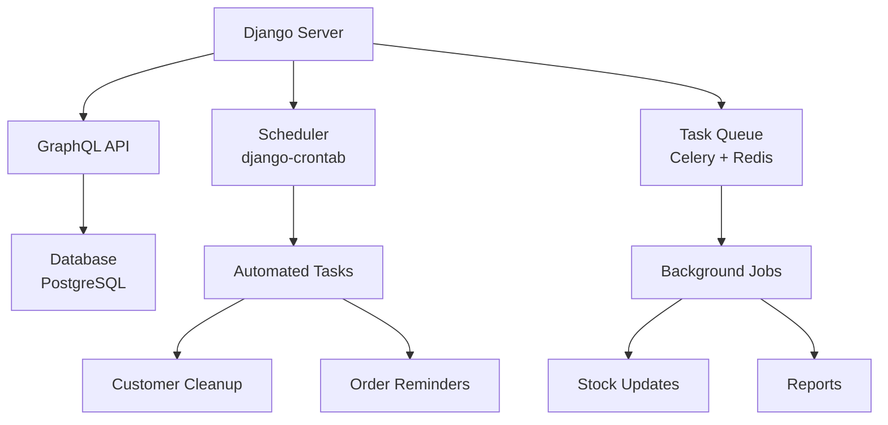

# 📊 CRM GraphQL System - Complete Installation & Setup Guide

## 🎯 System Architecture Overview



## 📋 Prerequisites Checklist

### ✅ Before You Begin

| Requirement | Version | Verification Command |
|------------|---------|---------------------|
| Python | 3.8+ | `python3 --version` |
| PostgreSQL | 12+ | `psql --version` |
| Redis | 6+ | `redis-server --version` |
| pip | Latest | `pip3 --version` |
| Git | Any | `git --version` |

### 🖥️ System-Specific Setup

**Ubuntu/Debian:**
```bash
# Update and install system packages
sudo apt update && sudo apt upgrade -y
sudo apt install -y python3 python3-pip python3-venv python3-dev
sudo apt install -y postgresql postgresql-contrib libpq-dev
sudo apt install -y redis-server nginx supervisor
```

**macOS:**
```bash
# Install Homebrew if not present
/bin/bash -c "$(curl -fsSL https://raw.githubusercontent.com/Homebrew/install/HEAD/install.sh)"

# Install packages
brew install python3 postgresql redis nginx
brew services start postgresql
brew services start redis
```

**Windows (WSL2 Recommended):**
```bash
# Enable WSL2 and install Ubuntu
# Then follow Ubuntu instructions above
```

## 🚀 Step-by-Step Installation

### 1️⃣ Clone & Prepare Repository
```bash
# Clone the project
git clone https://github.com/your-org/alx-backend-graphql_crm.git
cd alx-backend-graphql_crm

# Create virtual environment
python3 -m venv venv

# Activate virtual environment
# Linux/macOS:
source venv/bin/activate
# Windows:
.\venv\Scripts\activate

# Upgrade pip
pip install --upgrade pip setuptools wheel
```

### 2️⃣ Install Python Dependencies
```bash
# Install from requirements.txt
pip install -r requirements.txt

# Or install individually if issues arise
pip install django==4.0
pip install graphene-django==3.0
pip install django-crontab==0.7.1
pip install celery==5.2
pip install redis==4.3
pip install django-celery-beat==2.5
pip install gql==3.0
pip install requests==2.25
pip install psycopg2-binary==2.9
pip install django-cors-headers==3.10
```

### 3️⃣ Database Configuration

**PostgreSQL Setup:**
```bash
# Access PostgreSQL as admin
sudo -u postgres psql

# Inside psql shell, run:
CREATE DATABASE crm_graphql;
CREATE USER crm_user WITH PASSWORD 'secure_password_123';
ALTER ROLE crm_user SET client_encoding TO 'utf8';
ALTER ROLE crm_user SET default_transaction_isolation TO 'read committed';
ALTER ROLE crm_user SET timezone TO 'UTC';
GRANT ALL PRIVILEGES ON DATABASE crm_graphql TO crm_user;
\q
```

**Verify Database Connection:**
```bash
# Test connection
psql -h localhost -U crm_user -d crm_graphql -W
# Enter password when prompted
```

### 4️⃣ Environment Configuration

Create `.env` file at project root:
```bash
# ========================================
# DJANGO CONFIGURATION
# ========================================
SECRET_KEY='django-insecure-your-secret-key-here-for-development-only'
DEBUG=True
ALLOWED_HOSTS=localhost,127.0.0.1
TIME_ZONE=UTC

# ========================================
# DATABASE CONFIGURATION (PostgreSQL)
# ========================================
DB_ENGINE=django.db.backends.postgresql
DB_NAME=crm_graphql
DB_USER=crm_user
DB_PASSWORD=secure_password_123
DB_HOST=localhost
DB_PORT=5432

# ========================================
# REDIS & CELERY CONFIGURATION
# ========================================
REDIS_URL=redis://localhost:6379/0
CELERY_BROKER_URL=redis://localhost:6379/0
CELERY_RESULT_BACKEND=redis://localhost:6379/0
CELERY_TIMEZONE=UTC

# ========================================
# CRM APPLICATION SETTINGS
# ========================================
INACTIVE_CUSTOMER_DAYS=365
ORDER_REMINDER_DAYS=7
LOW_STOCK_THRESHOLD=10
STOCK_RESTOCK_AMOUNT=10
HEARTBEAT_INTERVAL_MINUTES=5

# ========================================
# EMAIL CONFIGURATION (for reminders)
# ========================================
EMAIL_BACKEND=django.core.mail.backends.console.EmailBackend
EMAIL_HOST=smtp.gmail.com
EMAIL_PORT=587
EMAIL_USE_TLS=True
EMAIL_HOST_USER=your-email@gmail.com
EMAIL_HOST_PASSWORD=your-app-password
DEFAULT_FROM_EMAIL='CRM System <noreply@example.com>'

# ========================================
# CORS & SECURITY
# ========================================
CORS_ALLOWED_ORIGINS=http://localhost:3000,http://localhost:8000
CSRF_TRUSTED_ORIGINS=http://localhost:3000,http://localhost:8000
```

### 5️⃣ Initialize Database
```bash
# Apply migrations
python manage.py makemigrations
python manage.py migrate

# Create superuser for admin access
python manage.py createsuperuser
# Follow prompts to create admin account

# Collect static files
python manage.py collectstatic --noinput

# Create necessary directories
mkdir -p logs media static
mkdir -p /tmp/crm_logs  # For cron job logs
```

### 6️⃣ Configure Redis
```bash
# Start Redis server
redis-server

# Test Redis connection
redis-cli ping
# Should return "PONG"

# Optional: Configure Redis persistence
sudo nano /etc/redis/redis.conf
# Uncomment: save 900 1
# Uncomment: save 300 10
# Uncomment: save 60 10000
```

## ⚡ Running the System

### Service Startup Sequence

Open **multiple terminal windows** and run:

**Terminal 1 - Redis:**
```bash
# Start Redis server
redis-server
# Or use system service
sudo systemctl start redis-server
sudo systemctl enable redis-server
```

**Terminal 2 - Django Development Server:**
```bash
# Activate virtual environment
source venv/bin/activate

# Start Django
python manage.py runserver
# Server runs at: http://localhost:8000
```

**Terminal 3 - Celery Worker:**
```bash
source venv/bin/activate
celery -A crm worker -l info --concurrency=4
```

**Terminal 4 - Celery Beat (Scheduler):**
```bash
source venv/bin/activate
celery -A crm beat -l info --scheduler django_celery_beat.schedulers:DatabaseScheduler
```

**Terminal 5 - Setup Crontab Jobs:**
```bash
source venv/bin/activate

# Add scheduled jobs
python manage.py crontab add

# Verify jobs
python manage.py crontab show

# Expected output:
# Currently active jobs in crontab:
# 5c3a8b6a5f1d7e9b2a4c6d8e -> ('*/5 * * * *', 'crm.cron.log_crm_heartbeat')
# 7d9e2f4a6b8c1d3e5f7a9c2 -> ('0 */12 * * *', 'crm.cron.update_low_stock')
```

### Verification Commands

**Check All Services:**
```bash
# Create verification script
cat > verify_setup.sh << 'EOF'
#!/bin/bash
echo "=== CRM System Verification ==="
echo "Timestamp: $(date)"
echo ""

echo "1. Python Environment:"
python3 --version
pip --version
echo ""

echo "2. Database Status:"
pg_isready -h localhost -p 5432 && echo "✓ PostgreSQL: RUNNING" || echo "✗ PostgreSQL: DOWN"
echo ""

echo "3. Redis Status:"
redis-cli ping 2>/dev/null && echo "✓ Redis: RUNNING" || echo "✗ Redis: DOWN"
echo ""

echo "4. Django Server:"
curl -s http://localhost:8000/graphql > /dev/null && echo "✓ Django: RUNNING" || echo "✗ Django: DOWN"
echo ""

echo "5. Active Processes:"
echo "Django:   $(ps aux | grep -c '[r]unserver')"
echo "Celery:   $(ps aux | grep -c '[c]elery worker')"
echo "Celery Beat: $(ps aux | grep -c '[c]elery beat')"
echo ""

echo "6. Crontab Jobs:"
python manage.py crontab show 2>/dev/null || echo "Crontab not configured"
echo ""

echo "7. Log Files (last 2 lines each):"
for log in /tmp/crm_heartbeat_log.txt /tmp/low_stock_updates_log.txt; do
    if [ -f "$log" ]; then
        echo "$log:"
        tail -2 "$log"
    fi
done
EOF

chmod +x verify_setup.sh
./verify_setup.sh
```

## 🧪 Testing the Installation

### 1. GraphQL API Test
```bash
# Test basic GraphQL endpoint
curl -X POST http://localhost:8000/graphql \
  -H "Content-Type: application/json" \
  -d '{"query": "query { hello }"}' \
  && echo -e "\n✓ GraphQL API is working"

# Expected response: {"data": {"hello": "Hello from GraphQL!"}}

# Test mutation
curl -X POST http://localhost:8000/graphql \
  -H "Content-Type: application/json" \
  -d '{"query": "mutation { updateLowStockProducts { message } }"}' \
  && echo -e "\n✓ GraphQL mutations are working"
```

### 2. Manual Task Execution
```bash
# Run each cron task manually
python manage.py shell << 'EOF'
from datetime import datetime
print("=== Manual Task Execution ===")

# Test heartbeat
from crm.cron import log_crm_heartbeat
print(f"{datetime.now()} - Testing heartbeat...")
log_crm_heartbeat()
print("✓ Heartbeat logged to /tmp/crm_heartbeat_log.txt")

# Test stock update
from crm.cron import update_low_stock
print(f"{datetime.now()} - Testing stock update...")
update_low_stock()
print("✓ Stock update logged to /tmp/low_stock_updates_log.txt")

# Test report generation
from crm.tasks import generate_crm_report
print(f"{datetime.now()} - Testing report generation...")
result = generate_crm_report.delay()
print(f"✓ Report task submitted: {result.id}")
EOF
```

### 3. Web Interface Verification

| Service | URL | Credentials | Purpose |
|---------|-----|-------------|---------|
| GraphQL Playground | http://localhost:8000/graphql | None | API testing & exploration |
| Django Admin | http://localhost:8000/admin | Created during setup | System administration |
| Flower Dashboard | http://localhost:5555 | None (or set in config) | Celery task monitoring |

**Test Admin Login:**
```bash
# If you forgot admin credentials:
python manage.py shell << 'EOF'
from django.contrib.auth import get_user_model
User = get_user_model()
try:
    admin = User.objects.get(username='admin')
    admin.set_password('newpassword123')
    admin.save()
    print("Admin password reset to: newpassword123")
except:
    print("Creating admin user...")
    User.objects.create_superuser('admin', 'admin@example.com', 'admin123')
    print("Admin created: username=admin, password=admin123")
EOF
```

## 🔧 Configuration Details

### Cron Job Schedule

| Task | Schedule | Command | Log File |
|------|----------|---------|----------|
| System Heartbeat | Every 5 minutes | `crm.cron.log_crm_heartbeat` | `/tmp/crm_heartbeat_log.txt` |
| Customer Cleanup | Sunday 2:00 AM | `crm.cron.clean_inactive_customers` | `/tmp/customer_cleanup_log.txt` |
| Order Reminders | Daily 8:00 AM | `crm.cron.send_order_reminders` | `/tmp/order_reminders_log.txt` |
| Stock Updates | Every 12 hours | `crm.cron.update_low_stock` | `/tmp/low_stock_updates_log.txt` |

### Celery Beat Schedule

| Task | Schedule | Description |
|------|----------|-------------|
| CRM Reports | Monday 6:00 AM | Weekly summary of customers, orders, revenue |
| Health Check | Daily 9:00 AM | System health verification |
| Customer Stats | Friday 5:00 PM | Weekly customer statistics |

## 🐛 Troubleshooting Guide

### Common Issues & Solutions

**Issue 1: "Command not found" errors**
```bash
# Ensure virtual environment is activated
source venv/bin/activate

# Check Python path
which python3
which pip

# Reinstall requirements if needed
pip install -r requirements.txt --force-reinstall
```

**Issue 2: Database connection failed**
```bash
# Check PostgreSQL service
sudo systemctl status postgresql

# Test connection manually
psql -h localhost -U crm_user -d crm_graphql -W

# Reset permissions if needed
sudo -u postgres psql -c "ALTER USER crm_user WITH PASSWORD 'newpassword';"
```

**Issue 3: Redis connection issues**
```bash
# Check if Redis is running
redis-cli ping

# Restart Redis
sudo systemctl restart redis-server

# Check Redis logs
sudo tail -f /var/log/redis/redis-server.log
```

**Issue 4: Crontab jobs not executing**
```bash
# Check cron service
sudo systemctl status cron

# View cron logs
sudo tail -f /var/log/syslog | grep CRON

# Test cron job manually
python manage.py crontab run <job-hash>

# Reset crontab
python manage.py crontab remove
python manage.py crontab add
```

**Issue 5: Permission denied for log files**
```bash
# Fix permissions on log directories
sudo mkdir -p /tmp/crm_logs
sudo chown -R $USER:$USER /tmp/crm_logs
sudo chmod -R 755 /tmp/crm_logs

# Fix project directory permissions
sudo chown -R $USER:$USER /path/to/alx-backend-graphql_crm
sudo chmod -R 755 /path/to/alx-backend-graphql_crm
```

**Issue 6: Port already in use**
```bash
# Check what's using port 8000
sudo lsof -i :8000

# Kill the process
sudo kill -9 <PID>

# Or use different port
python manage.py runserver 8001
```

## 📊 Monitoring & Maintenance

### Health Monitoring Script
```bash
cat > monitor_crm.sh << 'EOF'
#!/bin/bash
# CRM System Monitor
RED='\033[0;31m'
GREEN='\033[0;32m'
YELLOW='\033[1;33m'
NC='\033[0m' # No Color

echo -e "${YELLOW}=== CRM System Health Dashboard ===${NC}"
echo "Last Updated: $(date)"
echo ""

# Service Status
services=("postgresql" "redis-server" "cron")
for service in "${services[@]}"; do
    if systemctl is-active --quiet $service; then
        echo -e "${GREEN}✓${NC} $service: RUNNING"
    else
        echo -e "${RED}✗${NC} $service: STOPPED"
    fi
done

# Process Status
echo ""
echo -e "${YELLOW}Process Status:${NC}"
ps aux | grep -E "(python.*runserver|celery.*worker|celery.*beat)" | grep -v grep | while read line; do
    echo "  $line"
done

# Log Summary
echo ""
echo -e "${YELLOW}Recent Activity:${NC}"
for log in /tmp/crm_heartbeat_log.txt /tmp/low_stock_updates_log.txt; do
    if [ -f "$log" ]; then
        echo "$(basename $log):"
        tail -3 "$log" | sed 's/^/  /'
    fi
done

# Disk Usage
echo ""
echo -e "${YELLOW}Resource Usage:${NC}"
df -h / | tail -1
free -h | grep Mem
EOF

chmod +x monitor_crm.sh
./monitor_crm.sh
```

### Log File Management
```bash
# Rotate log files daily
sudo nano /etc/logrotate.d/crm

# Add configuration:
/tmp/*_log.txt {
    daily
    rotate 7
    compress
    delaycompress
    missingok
    notifempty
    create 644 $USER $USER
}
```

## 🚀 Production Deployment Checklist

### Security Hardening
```bash
# Generate secure secret key
python -c "from django.core.management.utils import get_random_secret_key; print(get_random_secret_key())"

# Update .env for production
DJANGO_DEBUG=False
SECRET_KEY='generated-secure-key-here'
ALLOWED_HOSTS=yourdomain.com,www.yourdomain.com,ip-address
CSRF_TRUSTED_ORIGINS=https://yourdomain.com,https://www.yourdomain.com
```

### Production Services Setup
```bash
# Install Gunicorn
pip install gunicorn

# Create systemd service for Django
sudo nano /etc/systemd/system/crm.service

# Content:
[Unit]
Description=CRM Django Application
After=network.target postgresql.service redis-server.service

[Service]
User=www-data
Group=www-data
WorkingDirectory=/path/to/alx-backend-graphql_crm
ExecStart=/path/to/venv/bin/gunicorn --workers 3 --bind 0.0.0.0:8000 crm.wsgi:application
Restart=always
RestartSec=10

[Install]
WantedBy=multi-user.target

# Enable and start
sudo systemctl daemon-reload
sudo systemctl enable crm.service
sudo systemctl start crm.service
```

## 📚 Quick Reference Commands

### Most Used Commands
```bash
# Start all services
./start_all.sh

# Stop all services
./stop_all.sh

# View logs
tail -f /tmp/crm_heartbeat_log.txt
tail -f logs/django.log

# Reset system
python manage.py flush --noinput
python manage.py migrate
python manage.py crontab remove && python manage.py crontab add

# Backup database
pg_dump -U crm_user -h localhost crm_graphql > backup_$(date +%Y%m%d).sql
```

### Create Service Management Scripts
```bash
# start_all.sh
#!/bin/bash
echo "Starting CRM System..."
redis-server &
sleep 2
celery -A crm worker -l info --concurrency=4 &
celery -A crm beat -l info &
python manage.py runserver &
echo "All services started!"

# stop_all.sh
#!/bin/bash
echo "Stopping CRM System..."
pkill -f "celery worker"
pkill -f "celery beat"
pkill -f "runserver"
pkill -f "redis-server"
echo "All services stopped!"
```

## 🔗 Useful Resources

- **Django Documentation**: https://docs.djangoproject.com/
- **GraphQL Documentation**: https://graphql.org/learn/
- **Celery Documentation**: https://docs.celeryproject.org/
- **Redis Documentation**: https://redis.io/documentation
- **PostgreSQL Documentation**: https://www.postgresql.org/docs/

## 📞 Support

If you encounter issues not covered in this guide:

1. Check the log files in `/tmp/` and `logs/` directories
2. Verify all services are running with `./verify_setup.sh`
3. Consult the troubleshooting section
4. Check for error messages in terminal outputs

For persistent issues, please:
- Provide the output of `./verify_setup.sh`
- Include relevant log snippets
- Specify your operating system and version

---

**Note**: This setup guide assumes a fresh installation. If you're upgrading from a previous version, backup your database before proceeding.

**Success Indicators**:
- ✓ GraphQL API responds at http://localhost:8000/graphql
- ✓ Cron jobs are listed with `python manage.py crontab show`
- ✓ Celery workers are processing tasks
- ✓ Log files are being created in `/tmp/`
- ✓ All services show as RUNNING in verification script

If all indicators show ✓, your CRM GraphQL system is successfully installed and running!
